Akkaya Mikail

Chevrier Séréna

MP3D

#  			Projet suivi température

## Sommaire :

##### Introduction

##### I. Installation du Raspberry-Pi et de l'ESP32

##### II. Acquisition et transmission des données

##### III. Affichage et interface utilisateur

##### IV. Stockage et exploitation des données

##### V. Sécurisation et fiabilité

##### VI. Alertes et Automatisation

### Introduction :

Dans ce projet, nous allons concevoir un système de surveillance de température en utilisant un capteur LM35, une carte ESP32, un Raspberry Pi ainsi que le protocole MQTT. Le but principalement sera de transmettre les données du capteur de température au Raspberry Pi via Mosquitto et le réseau Wi-Fi, les stocker dans une base de données SQLite et les afficher en temps réel à l'aide du Node-Red.

### I. Installation du Raspberry-Pi et de l'ESP32

Tout d'abord, nous avons procédé au montage du capteur de température LM35 et de la carte ESP32 sur une plaque de prototypage, tout en étant vigilants sur les branchements. Les documents ci-dessous montrent comment lier le capteur à la carte. Nous obtenons le montage ci-dessous :

Nous avons aussi relié le Raspberry-Pi à l'ordinateur comme ceci :

Les deux câbles USB sont reliés au clavier et à la souris de l'ordinateur. Le câble HDMI est relié au PC directement, il correspond à un autre port de connexion pour l'écran. Enfin, le dernier câble correspond à l'alimentation du Raspberry.

### II. Acquisition et transmission des données

L'objectif dans cette partie est d'acquérir les données de température du capteur LM35 et les transmettre sur Node-red via MQTT et la connexion Wi-Fi. Le schéma explicatif se présente comme ci-dessous :

#### 

La première étape est d'acquérir les données de température du capteur LM35. Pour cela, nous exécutons le programme Arduino ci-dessous.

\*\*\*#include <WiFi.h> // Enables the ESP32 to connect to the local network (via WiFi)
#include <PubSubClient.h> // Connect and publish to the MQTT broker

// WiFi
const char\* ssid = "LoraChoco";                 // Your personal network SSID
const char\* wifi\_password = "MRB3HBM0R28"; // Your personal network password

// MQTT
const char\* mqtt\_server = "centreia.fr";  // IP of the MQTT broker
const char\* temperature\_topic = "serena-mikail";
const char\* mqtt\_username = "user\_iut"; // MQTT username
const char\* mqtt\_password = "IUT2026"; // MQTT password
const char\* clientID = "client\_cter\_esp32\_classroom"; // MQTT client ID

// Initialise the WiFi and MQTT Client objects
WiFiClient wifiClient;
// 1883 is the listener port for the Broker
PubSubClient client(mqtt\_server, 1883, wifiClient);

// Custom function to connet to the MQTT broker via WiFi
void connect\_MQTT(){

// Connect to MQTT Broker
// client.connect returns a boolean value to let us know if the connection was successful.
// If the connection is failing, make sure you are using the correct MQTT Username and Password (Setup Earlier in the Instructable)
if (client.connect(clientID, mqtt\_username, mqtt\_password)) {
Serial.println("Connected to MQTT Broker!");
}
else {
Serial.println("Connection to MQTT Broker failed...");
}
}

void setup() {

Serial.begin(9600);

// Oublie de l'ancienne config Wifi
WiFi.disconnect(true);
delay(1000);
WiFi.mode(WIFI\_STA); // mode station

// Connect to Wifi
Serial.print("Connecting to ");
Serial.println(ssid);
WiFi.begin(ssid, wifi\_password);

// Wait until the connection has been confirmed before continuing
while (WiFi.status() != WL\_CONNECTED) {
delay(500);
Serial.print(".");
}

    // Debugging - Output the IP Address of the ESP32

Serial.println("WiFi connected");
Serial.print("IP address: ");
Serial.println(WiFi.localIP());
}

void loop() {
connect\_MQTT();
Serial.setTimeout(2000);

int raw = analogRead(34);
Serial.print("raw : ");
Serial.println(raw);

float volts = (float)raw\*3.3/4095; // il faut forcer volt a être un float sinon la division renvoie un int (donc 0 au lieu de 0.2)
Serial.print("volts : ");
Serial.println(volts);

float degres = volts/0.01;
Serial.print("degres : ");
Serial.println(degres);

// MQTT can only transmit strings
String temperature\_string = String(degres);

// PUBLISH to the MQTT Broker (topic = Temperature, defined at the beginning)
if (client.publish(temperature\_topic, temperature\_string.c\_str())) {
Serial.println("Temperature sent!");
}
// client.publish will return a boolean value depending on whether it succeded or not.
// If the message failed to send, we will try again, as the connection may have broken.
else {
Serial.println("Temperature failed to send. Reconnecting to MQTT Broker and trying again");
client.connect(clientID, mqtt\_username, mqtt\_password);
delay(10); // This delay ensures that client.publish doesn't clash with the client.connect call
client.publish(temperature\_topic, temperature\_string.c\_str());
}

client.disconnect();  // disconnect from the MQTT broker
delay(1000*10);       // print new values every 10 seconds
}*\*\*

Ce programme permet aussi de connecter la carte Arduino au réseau Wi-Fi (LoraChoco). Nous utilisons ce Wi-Fi et pas un autre car c'est celui qui est le plus fiable pour notre projet et qui ne sature pas facilement.
Ensuite, on s'occupe du Raspberry-Pi avec la mise en place du MQTT et du Mosquitto. Mosquitto et le broker MQTT ont déjà été installés et configurés lors d'un TD pour interdire les utilisateurs anonymes de se connecter sur le broker (mise en place d'un identifiant et d'un mot de passe déjà crées) et que le broker soit accessible sur le port 1883. On active le broker Mosquitto dans le terminal à l'aide de la commande: "sudo systemctl start mosquitto". Pour rendre le Raspberry autonome avec le broker avec le broker qui tourne dès qu'il est alimenté, on utulise cette commande: "sudo systemctl enable mosquitto". Ensuite, on tente de se connecter au serveur avec l'identifiant et le mot de passe déjà prédéfinis, mais, sans succès. On nous dit que la connexion a été refusée. Ces erreurs sont illustrées dans la première partie de la capture ci-dessous :

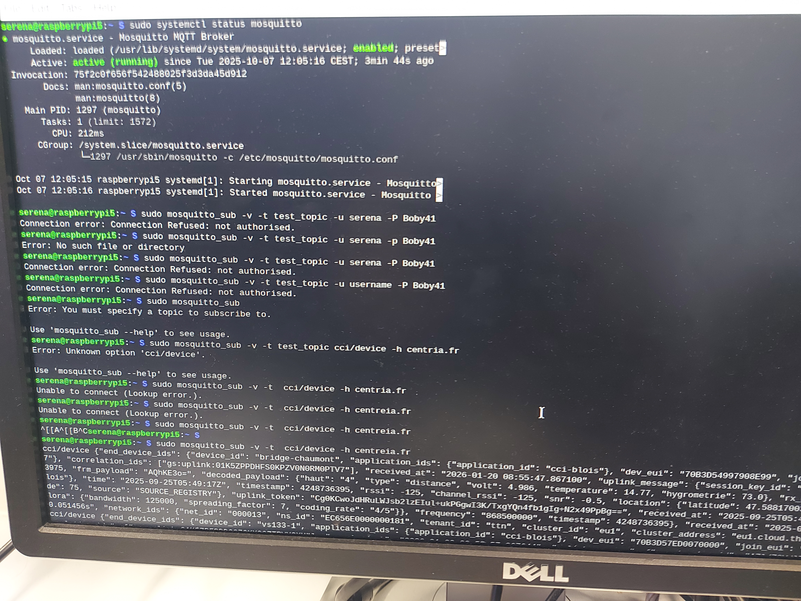

Puisqu'on ne parvient pas à se connecter sur mosquitto, on va alors se connecter sur "centreia.fr" qui est un équivalent.

### III. Affichage et interface utilisateur

Après avoir connecté le Raspberry e la carte Arduino sur un serveur commun, nous allons ensuite utiliser Node-Red qui sera notre interface pour la visualisation des données transmises par le capteur LM35 et la carte ESP32. Tout d'abord, on l'installe sur Raspberry pour qu'on puisse y accéder :

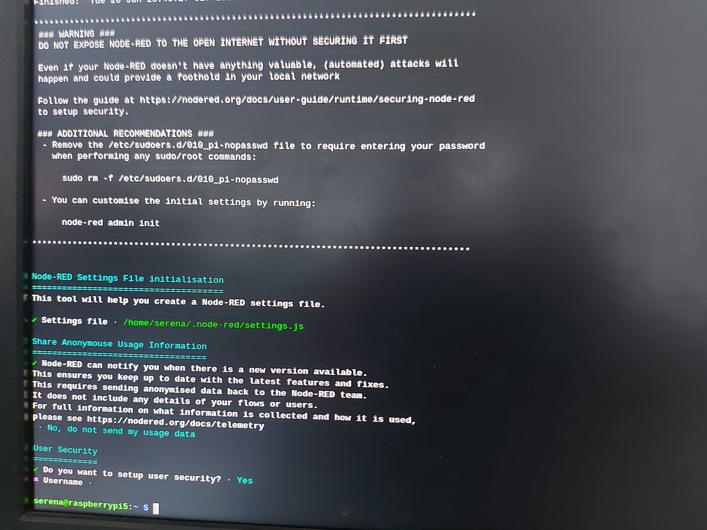

Après l'avoir installé, on l'active à l'aide des commandes: "sudo systemctl enable nodered.service" et "node-red-pi --max-old-space-size=256", puis, on l'ouvre dans le navigateur en tapant cette adresse: "http://localhost:1880". Dans un premier temps, nous effectuons le schéma de blocs ci-dessous :

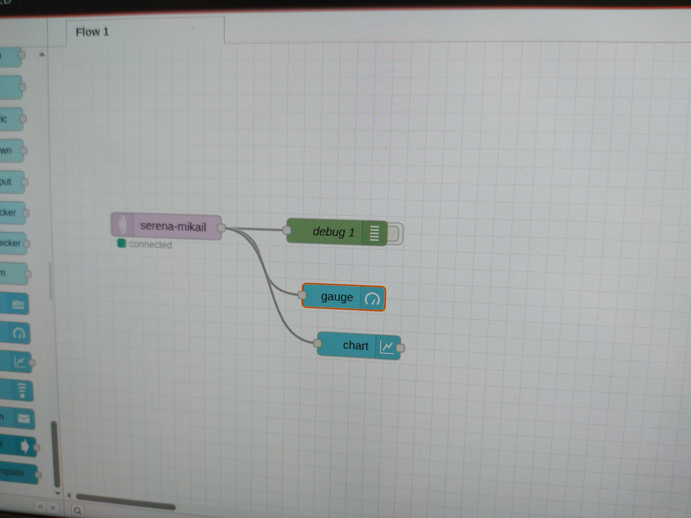

Le bloc violet nommé "serena-mikail" correspond aux données de températures du capteur LM35 au centreia. En effet, si on reprend le schéma de l'architecture du projet, les données de température acquises par la capteur sont transmises au serveur MQTT centreia.fr. On peut récupérer ces données en configurant bien le bloc comme ci-dessous:

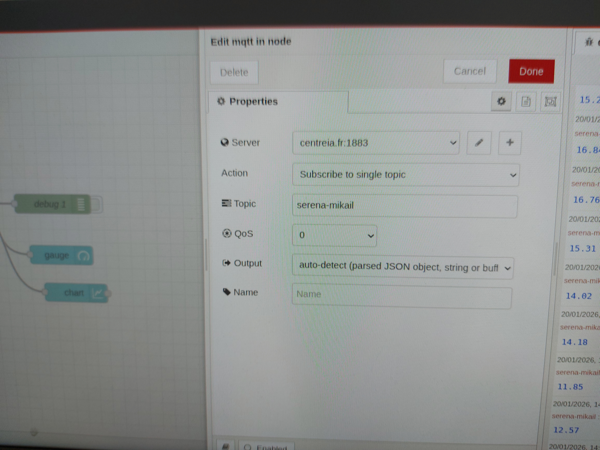

En allant plus dans les détails, dans les paramètres plus avancés :

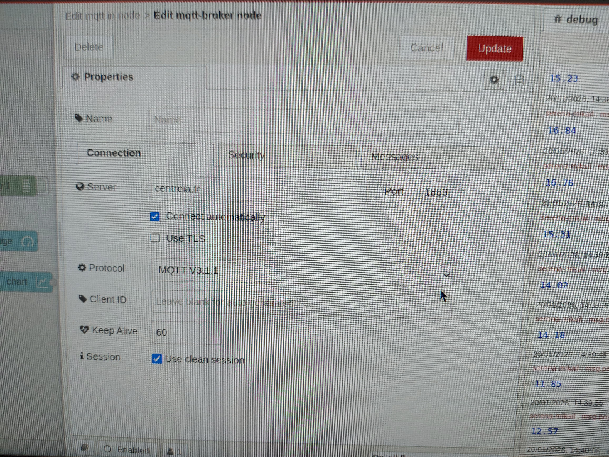

Ensuite, le bloc vert est utilisé en tant que sortie. Enfin les blocs bleus représentent les sorties en tant que graphiques. Le "gauge" correspond à une jauge et "chart" correspond à un graphique avec un axe X (heure) et un axe Y (température relevée). On configure les 2 blocs bleus aussi comme ci-dessous :

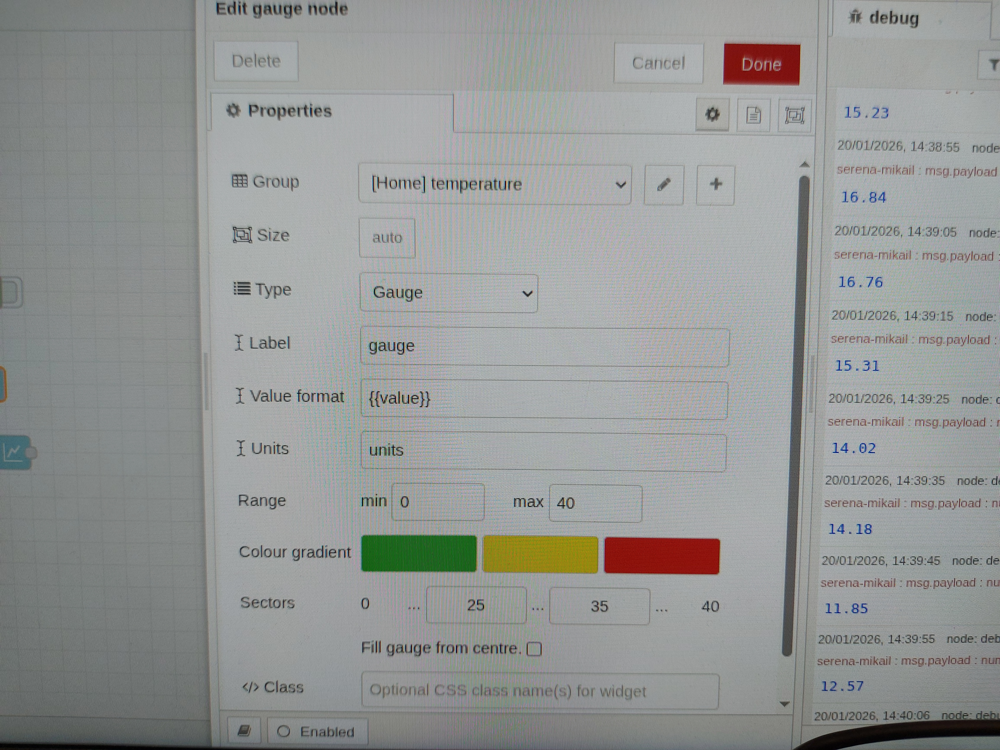
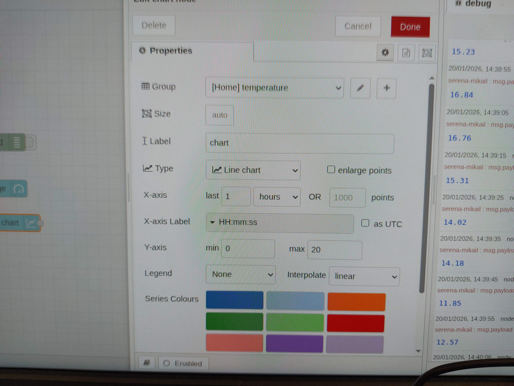

Il faut bien sûr faire attention à mettre les 2 blocs bleus dans le même "Group" comme par exemple ici avec: "[Home]temperature".
Ensuite, on déploie l'ensemble des blocs et on obtient une donnée de température toutes les 10 secondes sur l'interface grâce au bloc violet d'entrée et au bloc vert de sortie :

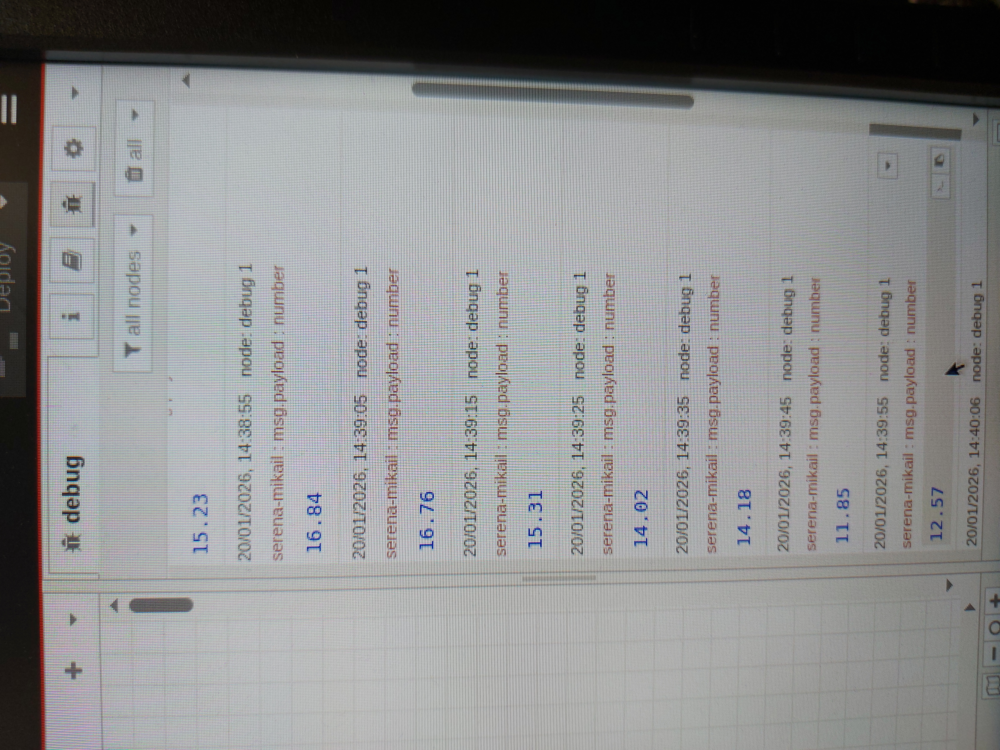

En allant ensuite dans un nouvel onglet à l'aide de cette adresse: "http://<hostname>:1880" où le "hostname" est l'adresse IP qu'on peut retrouver en laissant notre souris sur l'icône du Wi-Fi ou en tapant cette commande sur le terminal: "hostname -I". Cet onglet montre les données de températures obtenues sous forme de jauge et sous forme de graphique:

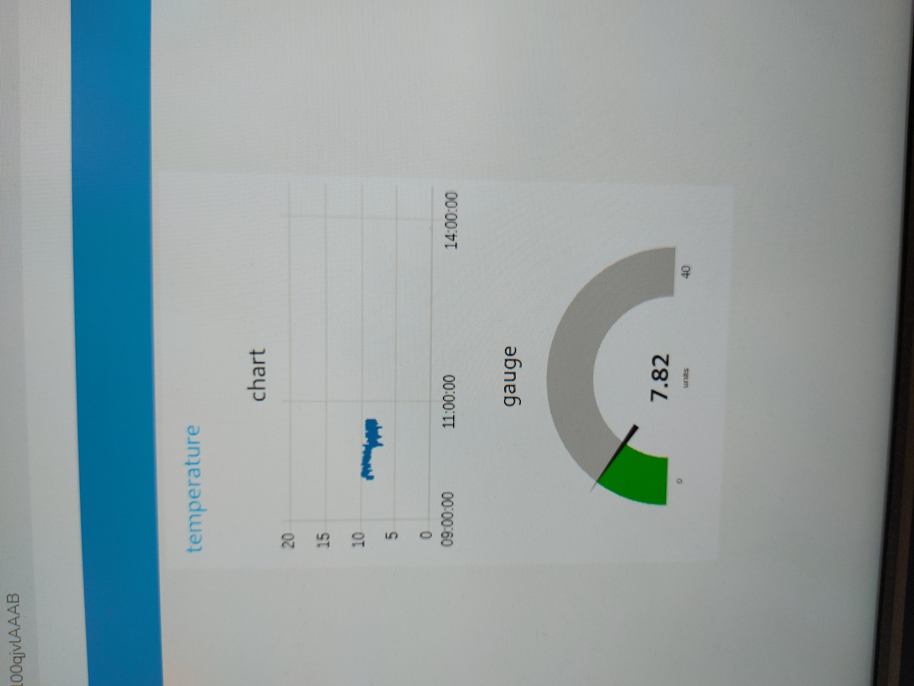

### IV. Stockage et exploitation des données

L'objectif dans cette partie est que maintenant qu'on a les données, on va les enregistrer dans une base SQLite sur le Raspberry Pi et on va mettre en place une structure de base de données plus optimisée de type historique. Pour mettre en place tout ceci, nous allons tout d'abord installer "sqlite3" dans le Raspberry-Pi à l'aide de la commande: "sudo apt install sqlite3". Ensuite, on relie sqlite3 au database du SQLite crée sur Node-Red qui s'appelle ici: "/tmp/sqlite". Tout ceci est illustré dans la capture ci-dessous:

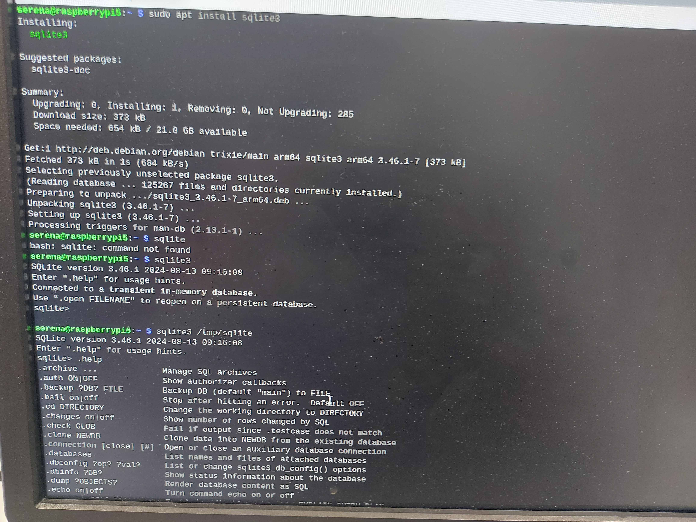

Ensuite, on crée une table de mesures qu'on appelle "mesures2" qui va faire office d'historiques avec 1 colonne date et heure et une colonne température relevée. 
Sur Node-Red, on reprend le même schéma blocs, mais, on ajoute le bloc "fonction" et le bloc "SQLite" comme ci-dessous:

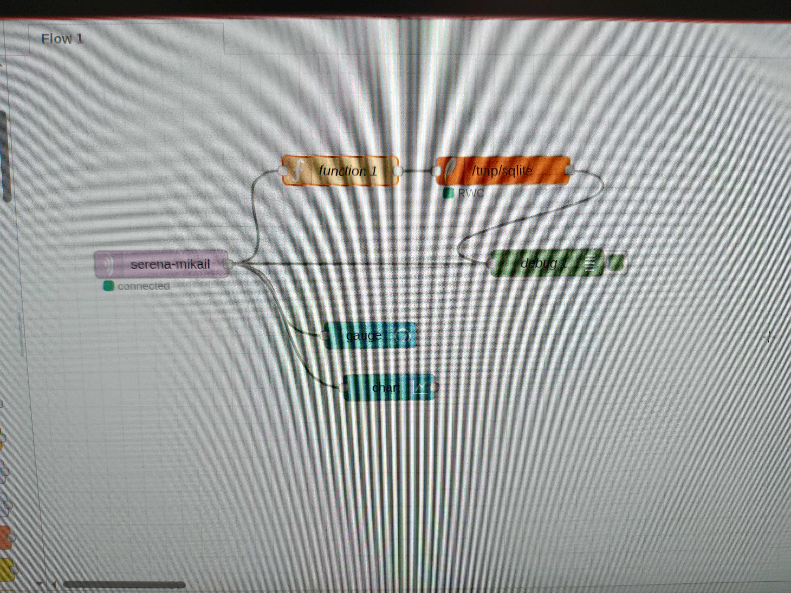

Le bloc "fonction" va permettre de définir le "msg.topic" qui est dans le bloc "SQLite". Les configurations de ces 2 blocs respectivement sont :

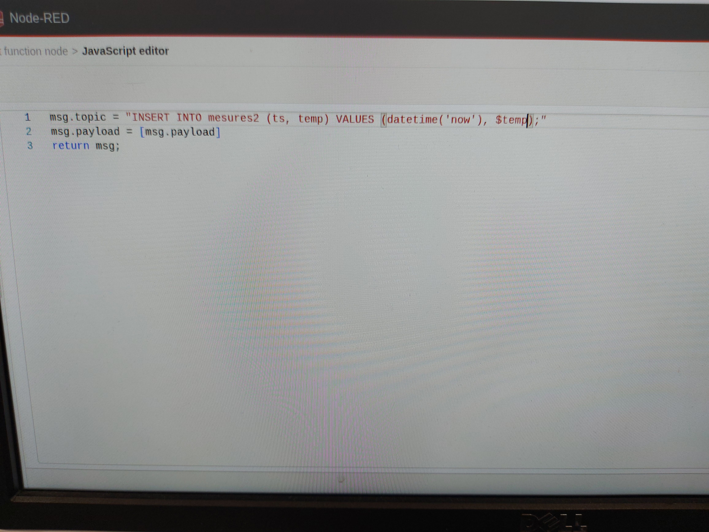

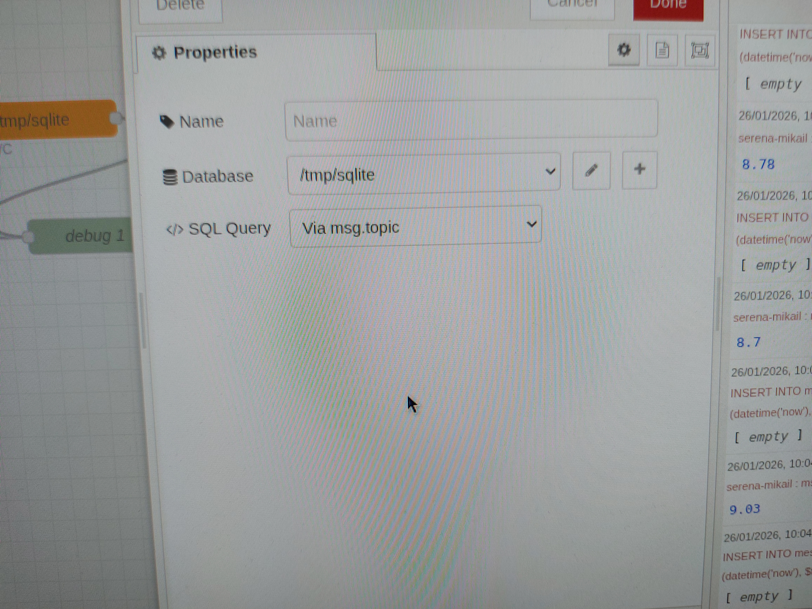

On revient sur le terminal du Raspberry pour visualiser la table "mesures2". Pour obtenir cette dernière, on tape la commande suivante: "SELECT * from mesures2;". L'image qui suit montre qu'on obtient les données sur la Raspberry de manière plus organisée, soit en format historique:

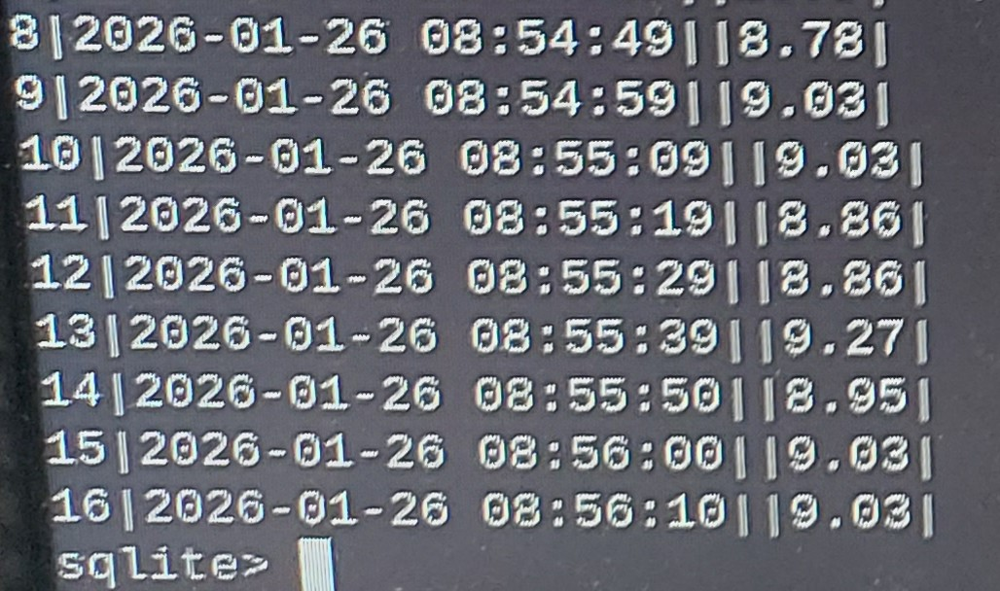

#### V. Sécurisation et Fiabilité

##### 

