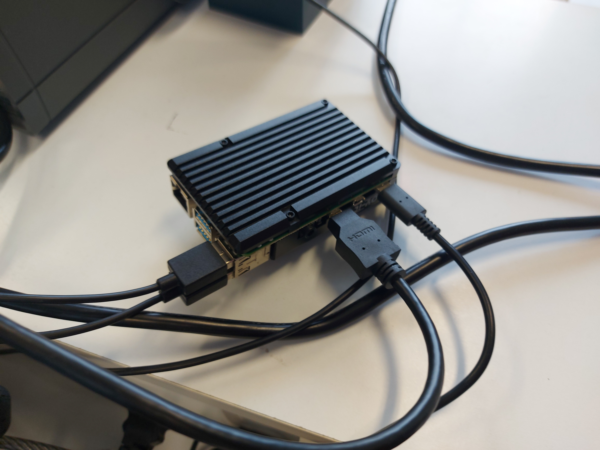

Akkaya Mikail

Chevrier Séréna

MP3D

#  			Projet suivi température

## Sommaire :

##### Introduction

##### I. Installation du Raspberry-Pi et de l'ESP32

##### II. Acquisition et transmission des données

##### III. Affichage et interface utilisateur

##### IV. Stockage et exploitation des données

##### V. Sécurisation et fiabilité

##### VI. Alertes et Automatisation

## Introduction :

Dans ce projet, nous allons concevoir un système de surveillance de température en utilisant un capteur LM35, une carte ESP32, un Raspberry Pi ainsi que le protocole MQTT. Le but principalement sera de transmettre les données du capteur de température au Raspberry Pi via Mosquitto et le réseau Wi-Fi, les stocker dans une base de données SQLite et les afficher en temps réel à l'aide du Node-Red.

### I. Installation du Raspberry-Pi et de l'ESP32

Tout d'abord, nous avons procédé au montage du capteur de température LM35 et de la carte ESP32 sur une plaque de prototypage, tout en étant vigilants sur les branchements. Les documents ci-dessous montrent comment lier le capteur à la carte. Nous obtenons le montage ci-dessous :

Nous avons aussi relié le Raspberry-Pi à l'ordinateur comme ceci :

Les deux câbles USB sont reliés au clavier et à la souris de l'ordinateur. Le câble HDMI est relié au PC directement, il correspond à un autre port de connexion pour l'écran. Enfin, le dernier câble correspond à l'alimentation du Raspberry.

### II. Acquisition et transmission des données

L'objectif dans cette partie est d'acquérir les données de température du capteur LM35 et les transmettre sur Node-red via MQTT et la connexion Wi-Fi. Le schéma explicatif se présente comme ci-dessous :

#### 

La première étape est d'acquérir les données de température du capteur LM35. Pour cela, nous exécutons le programme Arduino ci-dessous.

***#include <WiFi.h> // Enables the ESP32 to connect to the local network (via WiFi) 
#include <PubSubClient.h> // Connect and publish to the MQTT broker 
 
// WiFi 
const char* ssid = "LoraChoco";                 // Your personal network SSID 
const char* wifi_password = "MRB3HBM0R28"; // Your personal network password 
 
// MQTT 
const char* mqtt_server = "centreia.fr";  // IP of the MQTT broker 
const char* temperature_topic = "serena-mikail"; 
const char* mqtt_username = "user_iut"; // MQTT username 
const char* mqtt_password = "IUT2026"; // MQTT password 
const char* clientID = "client_cter_esp32_classroom"; // MQTT client ID 
 
// Initialise the WiFi and MQTT Client objects 
WiFiClient wifiClient; 
// 1883 is the listener port for the Broker 
PubSubClient client(mqtt_server, 1883, wifiClient);  
 
 
// Custom function to connet to the MQTT broker via WiFi 
void connect_MQTT(){ 
 
  // Connect to MQTT Broker 
  // client.connect returns a boolean value to let us know if the connection was successful. 
  // If the connection is failing, make sure you are using the correct MQTT Username and Password (Setup Earlier in the Instructable) 
  if (client.connect(clientID, mqtt_username, mqtt_password)) { 
    Serial.println("Connected to MQTT Broker!"); 
  } 
  else { 
    Serial.println("Connection to MQTT Broker failed..."); 
  } 
} 
 
void setup() { 
   
  Serial.begin(9600); 
 
  // Oublie de l'ancienne config Wifi 
  WiFi.disconnect(true); 
  delay(1000); 
  WiFi.mode(WIFI_STA); // mode station 
   
  // Connect to Wifi 
  Serial.print("Connecting to "); 
  Serial.println(ssid); 
  WiFi.begin(ssid, wifi_password); 
 
  // Wait until the connection has been confirmed before continuing 
  while (WiFi.status() != WL_CONNECTED) { 
    delay(500); 
    Serial.print("."); 
  }

    // Debugging - Output the IP Address of the ESP32 
  Serial.println("WiFi connected"); 
  Serial.print("IP address: "); 
  Serial.println(WiFi.localIP()); 
} 
 
void loop() { 
  connect_MQTT(); 
  Serial.setTimeout(2000); 
   
  int raw = analogRead(34); 
  Serial.print("raw : "); 
  Serial.println(raw); 
 
  float volts = (float)raw*3.3/4095; // il faut forcer volt a être un float sinon la division renvoie un int (donc 0 au lieu de 0.2) 
  Serial.print("volts : "); 
  Serial.println(volts); 
 
  float degres = volts/0.01; 
  Serial.print("degres : "); 
  Serial.println(degres); 
 
  // MQTT can only transmit strings 
  String temperature_string = String(degres); 
 
  // PUBLISH to the MQTT Broker (topic = Temperature, defined at the beginning) 
  if (client.publish(temperature_topic, temperature_string.c_str())) { 
    Serial.println("Temperature sent!"); 
  } 
  // client.publish will return a boolean value depending on whether it succeded or not. 
  // If the message failed to send, we will try again, as the connection may have broken. 
  else { 
    Serial.println("Temperature failed to send. Reconnecting to MQTT Broker and trying again"); 
    client.connect(clientID, mqtt_username, mqtt_password); 
    delay(10); // This delay ensures that client.publish doesn't clash with the client.connect call 
    client.publish(temperature_topic, temperature_string.c_str()); 
  } 
 
  client.disconnect();  // disconnect from the MQTT broker 
  delay(1000*10);       // print new values every 10 seconds 
}***

Ce programme permet aussi de connecter la carte Arduino au réseau Wi-Fi (LoraChoco). Nous utilisons ce Wi-Fi et pas un autre car c'est celui qui est le plus fiable pour notre projet et qui ne sature pas facilement.
Ensuite, on s'occupe du Raspberry-Pi avec la mise en place du MQTT et du Mosquitto. Mosquitto et le broker MQTT ont déjà été installés et configurés lors d'un TD pour interdire les utilisateurs anonymes de se connecter sur le broker (mise en place d'un identifiant et d'un mot de passe déjà crées) et que le broker soit accessible sur le port 1883. On active le broker Mosquitto dans le terminal à l'aide de la commande: "sudo systemctl start mosquitto". Pour rendre le Raspberry autonome avec le broker avec le broker qui tourne dès qu'il est alimenté, on utulise cette commande: "sudo systemctl enable mosquitto". Ensuite, on tente de se connecter au serveur avec l'identifiant et le mot de passe déjà prédéfinis, mais, sans succès. On nous dit que la connexion a été refusée. Ces erreurs sont illustrées dans la première partie de la capture ci-dessous :

### Capture

Puisqu'on ne parvient pas à se connecter sur mosquitto, on va alors se connecter sur "centreia.fr" qui est un équivalent.

##### 

